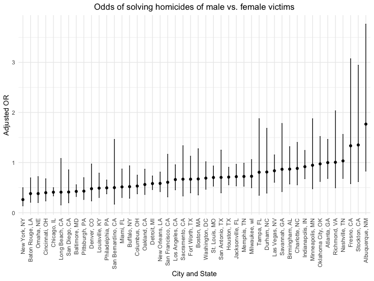
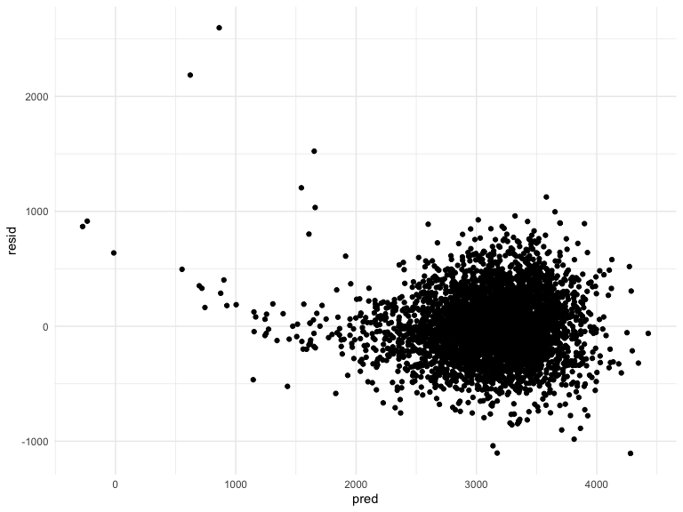
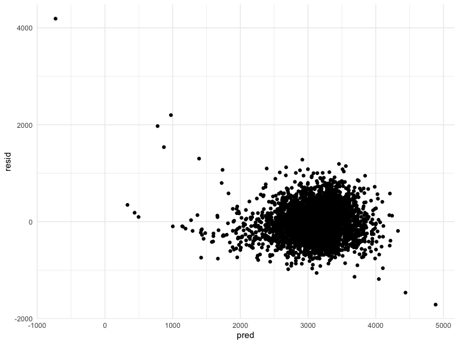
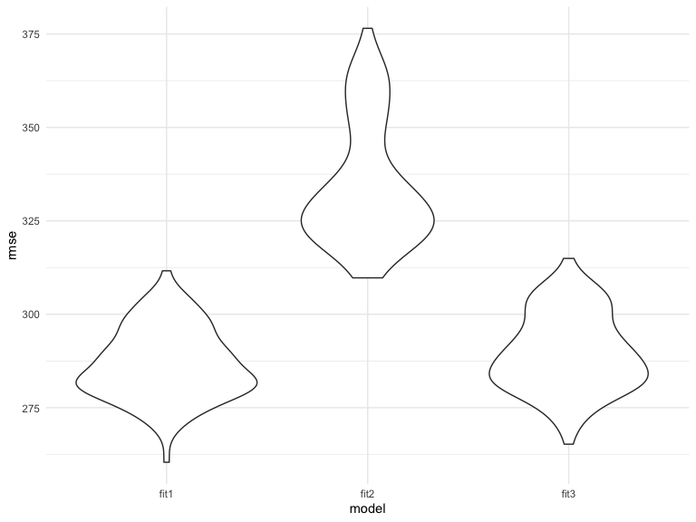

p8105_hw6_agg2965
================
Aakriti Shukla
2022-11-28

\#Problem 1 We used the the 2017 Central Park weather data for this
problem. First, we’ll load the data.

``` r
weather_df = 
  rnoaa::meteo_pull_monitors(
    c("USW00094728"),
    var = c("PRCP", "TMIN", "TMAX"), 
    date_min = "2017-01-01",
    date_max = "2017-12-31") %>%
  mutate(
    name = recode(id, USW00094728 = "CentralPark_NY"),
    tmin = tmin / 10,
    tmax = tmax / 10) %>%
  select(name, id, everything())
```

    ## Registered S3 method overwritten by 'hoardr':
    ##   method           from
    ##   print.cache_info httr

    ## using cached file: ~/Library/Caches/R/noaa_ghcnd/USW00094728.dly

    ## date created (size, mb): 2022-09-29 12:04:27 (8.401)

    ## file min/max dates: 1869-01-01 / 2022-09-30

The boostrap is helpful when you’d like to perform inference for a
parameter / value / summary that doesn’t have an easy-to-write-down
distribution in the usual repeated sampling framework. We’ll focus on a
simple linear regression with tmax as the response and tmin as the
predictor, and are interested in the distribution of two quantities
estimated from these data:

r̂ 2 log(β̂ 0∗β̂ 1) Use 5000 bootstrap samples and, for each bootstrap
sample, produce estimates of these two quantities. Plot the distribution
of your estimates, and describe these in words. Using the 5000 bootstrap
estimates, identify the 2.5% and 97.5% quantiles to provide a 95%
confidence interval for r̂ 2 and log(β̂ 0∗β̂ 1). Note: broom::glance() is
helpful for extracting r̂ 2 from a fitted regression, and broom::tidy()
(with some additional wrangling) should help in computing log(β̂ 0∗β̂ 1).

``` r
weatherboot_df = 
  tibble(
    x = tmin,
    error = r̂ 2
    log(β̂ 0∗β1), #what is the error term here
    y = tmax
  )


boot_straps = 
  data_frame(
    strap_number = 1:5000,
    strap_sample = rerun(5000, boot_sample(weatherboot_df))
  )

boot_straps
```

\#Problem 2 The Washington Post has gathered data on homicides in 50
large U.S. cities and made the data available through a GitHub
repository here. We will perform logistic regression analysis on this
dataset.

Let’s load the data.

``` r
homicides_df <- read.csv(url("https://raw.githubusercontent.com/washingtonpost/data-homicides/master/homicide-data.csv"))%>%
  janitor::clean_names()
```

Next, I have created a city_state variable and a binary variable
indicating whether the homicide is solved. I have omitted cities don’t
report victim race and data entry mistakes. I have limtied the analysis
those for whom victim_race is white or black and ensured that victim_age
is numeric.

``` r
homicides_clean=homicides_df%>%
  janitor::clean_names()%>%
    unite(city_state, c(city, state), sep = ", ")%>%
    filter(victim_race=="White" | victim_race=="Black")%>%
    subset(city_state!='Dallas, TX'& city_state!='Phoenix, AZ' & city_state!= 'Kansas City, MO' & city_state!= 'Tulsa, OK' & city_state!= 'Tulsa, AL')%>%
  mutate(
    solved = case_when(disposition=="Closed by arrest" ~ '1',
                           disposition=="Closed without arrest" |                              disposition=="Open/No arrest" ~ '0'),
    victim_age=as.numeric(victim_age),
    solved=as.numeric(solved),
    )
```

For the city of Baltimore, MD, we have used the glm function to fit a
logistic regression with resolved vs unresolved as the outcome and
victim age, sex and race as predictors. We have obtained an estimate and
confidence interval of the adjusted odds ratio for solving homicides
comparing male victims to female victims keeping all other variables
fixed.

``` r
baltimore_homicides=homicides_clean%>%
  filter(city_state %in% "Baltimore, MD")
```

``` r
balt_fit = baltimore_homicides %>% glm(solved~victim_age + victim_sex + victim_race, data=., family=binomial())

balt_fit%>% 
  broom::glance()
```

    ## # A tibble: 1 × 8
    ##   null.deviance df.null logLik   AIC   BIC deviance df.residual  nobs
    ##           <dbl>   <int>  <dbl> <dbl> <dbl>    <dbl>       <int> <int>
    ## 1         3568.    2752 -1746. 3501. 3524.    3493.        2749  2753

``` r
summary(balt_fit)
```

    ## 
    ## Call:
    ## glm(formula = solved ~ victim_age + victim_sex + victim_race, 
    ##     family = binomial(), data = .)
    ## 
    ## Deviance Residuals: 
    ##     Min       1Q   Median       3Q      Max  
    ## -1.6223  -0.8958  -0.8688   1.4699   1.6579  
    ## 
    ## Coefficients:
    ##                   Estimate Std. Error z value Pr(>|z|)    
    ## (Intercept)       0.309981   0.171295   1.810   0.0704 .  
    ## victim_age       -0.006727   0.003324  -2.024   0.0430 *  
    ## victim_sexMale   -0.854463   0.138176  -6.184 6.26e-10 ***
    ## victim_raceWhite  0.841756   0.174716   4.818 1.45e-06 ***
    ## ---
    ## Signif. codes:  0 '***' 0.001 '**' 0.01 '*' 0.05 '.' 0.1 ' ' 1
    ## 
    ## (Dispersion parameter for binomial family taken to be 1)
    ## 
    ##     Null deviance: 3567.9  on 2752  degrees of freedom
    ## Residual deviance: 3492.7  on 2749  degrees of freedom
    ## AIC: 3500.7
    ## 
    ## Number of Fisher Scoring iterations: 4

``` r
balt_fit%>%
  broom::tidy()%>%
  mutate(OR=exp(estimate),
         OR_conf_low=exp(OR-1.96*(std.error)),
         OR_conf_high=exp(OR+1.96*(std.error)))%>%
    select(term,log_OR=estimate,OR, OR_conf_low, OR_conf_high)
```

    ## # A tibble: 4 × 5
    ##   term               log_OR    OR OR_conf_low OR_conf_high
    ##   <chr>               <dbl> <dbl>       <dbl>        <dbl>
    ## 1 (Intercept)       0.310   1.36         2.79         5.47
    ## 2 victim_age       -0.00673 0.993        2.68         2.72
    ## 3 victim_sexMale   -0.854   0.426        1.17         2.01
    ## 4 victim_raceWhite  0.842   2.32         7.23        14.3

We then ran a glm for each of the cities in the dataset and extracted
the adjusted odds ratio (and CI) for solving homicides comparing male
victims to female victims.

``` r
homicides_clean %>% 
  glm(solved~victim_age + victim_sex + victim_race, data = .) %>%
  broom::tidy() %>% 
  knitr::kable(digits = 3)
```

| term              | estimate | std.error | statistic | p.value |
|:------------------|---------:|----------:|----------:|--------:|
| (Intercept)       |    0.584 |     0.009 |    65.612 |   0.000 |
| victim_age        |    0.000 |     0.000 |    -2.658 |   0.008 |
| victim_sexMale    |   -0.124 |     0.007 |   -17.287 |   0.000 |
| victim_sexUnknown |   -0.016 |     0.078 |    -0.211 |   0.833 |
| victim_raceWhite  |    0.144 |     0.007 |    19.992 |   0.000 |

``` r
homicides_clean%>%
  group_by(city_state)%>%
    summarize(
      total=n())
```

    ## # A tibble: 46 × 2
    ##    city_state      total
    ##    <chr>           <int>
    ##  1 Albuquerque, NM   178
    ##  2 Atlanta, GA       945
    ##  3 Baltimore, MD    2753
    ##  4 Baton Rouge, LA   410
    ##  5 Birmingham, AL    771
    ##  6 Boston, MA        492
    ##  7 Buffalo, NY       479
    ##  8 Charlotte, NC     584
    ##  9 Chicago, IL      4507
    ## 10 Cincinnati, OH    679
    ## # … with 36 more rows

``` r
homicides_fit =
  homicides_clean %>% 
  nest(data = -city_state) %>% 
  mutate(
    models = map(.x=data, ~glm(solved~victim_age + victim_sex + victim_race, data = .x, family=binomial())),
    results = map(models, broom::tidy)) %>% 
unnest(results)%>%
  filter(term == "victim_sexMale") %>%
    mutate(OR = exp(estimate),
           OR_conf_low = exp(estimate - 1.96*(std.error)),
         OR_conf_high = exp(estimate + 1.96*(std.error))) %>%
  select(city_state, OR, OR_conf_low, OR_conf_high) 

homicides_fit
```

    ## # A tibble: 46 × 4
    ##    city_state         OR OR_conf_low OR_conf_high
    ##    <chr>           <dbl>       <dbl>        <dbl>
    ##  1 Albuquerque, NM 1.77        0.831        3.76 
    ##  2 Atlanta, GA     1.00        0.684        1.46 
    ##  3 Baltimore, MD   0.426       0.325        0.558
    ##  4 Baton Rouge, LA 0.381       0.209        0.695
    ##  5 Birmingham, AL  0.870       0.574        1.32 
    ##  6 Boston, MA      0.674       0.356        1.28 
    ##  7 Buffalo, NY     0.521       0.290        0.935
    ##  8 Charlotte, NC   0.884       0.557        1.40 
    ##  9 Chicago, IL     0.410       0.336        0.501
    ## 10 Cincinnati, OH  0.400       0.236        0.677
    ## # … with 36 more rows

Below, we have created a plot that shows the estimated ORs and CIs for
each city. The odds of solving homicides of male victims was lower than
the odds of solving homicides of female victims in all studied cities
except for in Fresno CA, Stockton, CA, and Albuquerque, NM.

``` r
homicides_ordered=homicides_fit%>%
  mutate(
    city_state=fct_reorder(city_state,OR))
ggplot(homicides_ordered, aes(x=city_state, y=OR)) + 
    geom_errorbar(aes(ymin=OR_conf_low, ymax=OR_conf_high), width=.1) +
    geom_line() +
    geom_point()+
    labs(title = "Odds of solving homicides of male vs. female victims",
           x = "City and State",
       y="Adjusted OR") +
    theme(plot.title = element_text(hjust = 0.5))+
    theme(axis.text.x = element_text(angle = 90, vjust = 0.5, hjust=1))
```

    ## geom_path: Each group consists of only one observation. Do you need to adjust
    ## the group aesthetic?



\#Problem 3 In this problem, we analyzed data gathered to understand the
effects of several variables on a child’s birthweight.

First, let’s load the data.

``` r
birthweight_df<- read.csv("data/birthweight.csv")%>%
  janitor::clean_names()%>%
  mutate(
    id=1:4342
  )
```

Below, I have proposed a regression model (Model 1) for birthweight.
This model included head circumference, length, and gestational age in
weeks as predictors of birthweight. I first created this model and made
a plot of model residuals against fitted values using add_predictions
and add_residuals. The scatterplot demonstrates clustering from 2000g to
4000g, with a few outlying points in the very low birthweight range,
suggesting that this model may not be as valid for very low birthweight
babies. Of note, there are 3 negative birthweight values, which appear
to be errors in documentation.

``` r
bwt_fit1 = birthweight_df %>% lm (bwt~bhead+blength+gaweeks, data=.)

bwt_fit1%>% 
  broom::glance()
```

    ## # A tibble: 1 × 12
    ##   r.squared adj.r.sq…¹ sigma stati…² p.value    df  logLik    AIC    BIC devia…³
    ##       <dbl>      <dbl> <dbl>   <dbl>   <dbl> <dbl>   <dbl>  <dbl>  <dbl>   <dbl>
    ## 1     0.688      0.688  286.   3190.       0     3 -30719. 61449. 61481.  3.55e8
    ## # … with 2 more variables: df.residual <int>, nobs <int>, and abbreviated
    ## #   variable names ¹​adj.r.squared, ²​statistic, ³​deviance

``` r
summary(bwt_fit1)
```

    ## 
    ## Call:
    ## lm(formula = bwt ~ bhead + blength + gaweeks, data = .)
    ## 
    ## Residuals:
    ##      Min       1Q   Median       3Q      Max 
    ## -1105.73  -191.84   -10.99   178.74  2596.80 
    ## 
    ## Coefficients:
    ##              Estimate Std. Error t value Pr(>|t|)    
    ## (Intercept) -6195.572     96.352 -64.301   <2e-16 ***
    ## bhead         138.853      3.531  39.325   <2e-16 ***
    ## blength        81.643      2.084  39.177   <2e-16 ***
    ## gaweeks        14.601      1.509   9.677   <2e-16 ***
    ## ---
    ## Signif. codes:  0 '***' 0.001 '**' 0.01 '*' 0.05 '.' 0.1 ' ' 1
    ## 
    ## Residual standard error: 286.1 on 4338 degrees of freedom
    ## Multiple R-squared:  0.6881, Adjusted R-squared:  0.6879 
    ## F-statistic:  3190 on 3 and 4338 DF,  p-value: < 2.2e-16

``` r
birthweight_df %>% 
  modelr::add_residuals(bwt_fit1) %>% 
  modelr::add_predictions(bwt_fit1) %>% 
  ggplot(aes(x = pred, y = resid)) + geom_point()
```



I have now compared this model to two others. Model 2 uses length at
birth and gestational age as predictors, without including interaction
effects. The scatterplot demonstrates clustering from 2000g to 4000g.
This plot also has a a few outlying points in the very low birthweight
range, suggesting that this model may not be as valid for very low
birthweight babies. Of note, there is 1 negative birthweight value,
which appears to be an error in documentation.

``` r
bwt_fit2 = birthweight_df %>% lm (bwt~blength+gaweeks, data=.)

bwt_fit2%>% 
  broom::glance()
```

    ## # A tibble: 1 × 12
    ##   r.squared adj.r.sq…¹ sigma stati…² p.value    df  logLik    AIC    BIC devia…³
    ##       <dbl>      <dbl> <dbl>   <dbl>   <dbl> <dbl>   <dbl>  <dbl>  <dbl>   <dbl>
    ## 1     0.577      0.577  333.   2958.       0     2 -31381. 62771. 62796.  4.82e8
    ## # … with 2 more variables: df.residual <int>, nobs <int>, and abbreviated
    ## #   variable names ¹​adj.r.squared, ²​statistic, ³​deviance

``` r
summary(bwt_fit2)
```

    ## 
    ## Call:
    ## lm(formula = bwt ~ blength + gaweeks, data = .)
    ## 
    ## Residuals:
    ##     Min      1Q  Median      3Q     Max 
    ## -1709.6  -215.4   -11.4   208.2  4188.8 
    ## 
    ## Coefficients:
    ##              Estimate Std. Error t value Pr(>|t|)    
    ## (Intercept) -4347.667     97.958  -44.38   <2e-16 ***
    ## blength       128.556      1.990   64.60   <2e-16 ***
    ## gaweeks        27.047      1.718   15.74   <2e-16 ***
    ## ---
    ## Signif. codes:  0 '***' 0.001 '**' 0.01 '*' 0.05 '.' 0.1 ' ' 1
    ## 
    ## Residual standard error: 333.2 on 4339 degrees of freedom
    ## Multiple R-squared:  0.5769, Adjusted R-squared:  0.5767 
    ## F-statistic:  2958 on 2 and 4339 DF,  p-value: < 2.2e-16

``` r
birthweight_df  %>% 
  modelr::add_residuals(bwt_fit2) %>% 
  modelr::add_predictions(bwt_fit2) %>% 
  ggplot(aes(x = pred, y = resid)) + geom_point()
```


The other model (Model 3) uses head circumference, length, sex, and all
interactions (including the three-way interaction) between these
variables. The associated scatterplot shows findings as the other
models.

``` r
bwt_fit3 = birthweight_df %>% lm (bwt~ bhead + blength + babysex + bhead*blength + bhead*babysex + blength*babysex + bhead*blength*babysex, data=.)

bwt_fit3%>% 
  broom::glance()
```

    ## # A tibble: 1 × 12
    ##   r.squared adj.r.sq…¹ sigma stati…² p.value    df  logLik    AIC    BIC devia…³
    ##       <dbl>      <dbl> <dbl>   <dbl>   <dbl> <dbl>   <dbl>  <dbl>  <dbl>   <dbl>
    ## 1     0.685      0.684  288.   1346.       0     7 -30742. 61501. 61559.  3.59e8
    ## # … with 2 more variables: df.residual <int>, nobs <int>, and abbreviated
    ## #   variable names ¹​adj.r.squared, ²​statistic, ³​deviance

``` r
summary(bwt_fit3)
```

    ## 
    ## Call:
    ## lm(formula = bwt ~ bhead + blength + babysex + bhead * blength + 
    ##     bhead * babysex + blength * babysex + bhead * blength * babysex, 
    ##     data = .)
    ## 
    ## Residuals:
    ##      Min       1Q   Median       3Q      Max 
    ## -1132.99  -190.42   -10.33   178.63  2617.96 
    ## 
    ## Coefficients:
    ##                         Estimate Std. Error t value Pr(>|t|)    
    ## (Intercept)           -13551.685   2759.413  -4.911 9.39e-07 ***
    ## bhead                    380.189     83.395   4.559 5.28e-06 ***
    ## blength                  225.900     57.398   3.936 8.43e-05 ***
    ## babysex                 6374.868   1677.767   3.800 0.000147 ***
    ## bhead:blength             -4.432      1.715  -2.583 0.009815 ** 
    ## bhead:babysex           -198.393     51.092  -3.883 0.000105 ***
    ## blength:babysex         -123.773     35.119  -3.524 0.000429 ***
    ## bhead:blength:babysex      3.878      1.057   3.670 0.000245 ***
    ## ---
    ## Signif. codes:  0 '***' 0.001 '**' 0.01 '*' 0.05 '.' 0.1 ' ' 1
    ## 
    ## Residual standard error: 287.7 on 4334 degrees of freedom
    ## Multiple R-squared:  0.6849, Adjusted R-squared:  0.6844 
    ## F-statistic:  1346 on 7 and 4334 DF,  p-value: < 2.2e-16

``` r
birthweight_df  %>% 
  modelr::add_residuals(bwt_fit3) %>% 
  modelr::add_predictions(bwt_fit3) %>% 
  ggplot(aes(x = pred, y = resid)) + geom_point()
```



Next, we compare the three models using cross-validated prediction error
as per below. We have created resulting violin plots, which show that
the root mean standard error is highest with the second model, which
includes only length at birth and gestational age in weeks. This
suggests that this model is inferior to the others. This is unsurprising
as models 1 and 3 contained more prediction variables as compared to
model 2.

``` r
cv_df =
  crossv_mc(birthweight_df, 100) %>% 
  mutate(
    train = map(train, as_tibble),
    test = map(test, as_tibble))

cv_df = 
  cv_df %>% 
  mutate(
    bwt_fit1  = map(train, ~lm(bwt~ bhead+blength+gaweeks, data=.x)),
    bwt_fit2  = map(train, ~lm(bwt~blength+gaweeks, data=.x)),
    bwt_fit3  = map(train, ~lm(bwt~ bhead + blength + babysex + bhead*blength + bhead*babysex + blength*babysex + bhead*blength*babysex, data=.x))) %>% 
  mutate(
    rmse_fit1 = map2_dbl(bwt_fit1, test, ~rmse(model = .x, data = .y)),
    rmse_fit2 = map2_dbl(bwt_fit2, test, ~rmse(model = .x, data = .y)),
    rmse_fit3 = map2_dbl(bwt_fit3, test, ~rmse(model = .x, data = .y)))

cv_df%>% 
    select(starts_with("rmse")) %>% 
  pivot_longer(
    everything(),
    names_to = "model", 
    values_to = "rmse",
    names_prefix = "rmse_") %>% 
  mutate(model = fct_inorder(model)) %>% 
  ggplot(aes(x = model, y = rmse)) + 
    geom_violin()
```


